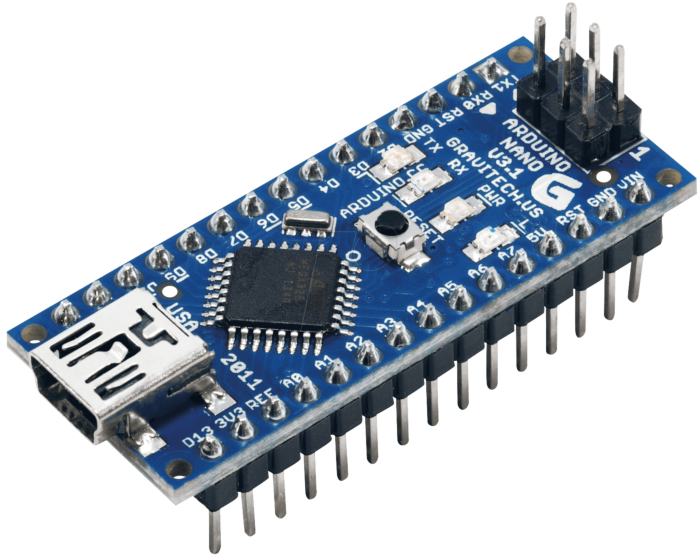
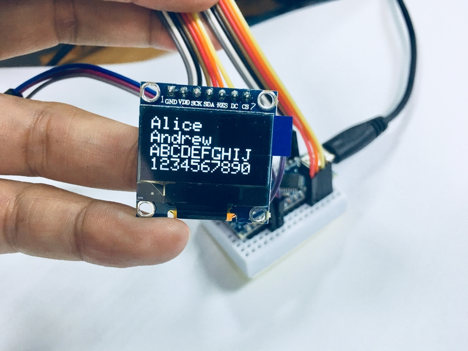

# water-temperature-meter

OLED Digital Display Water Temperature Meter

## 專案構思

當你要測量水溫下降變化時，你可以在市面上買到精度不錯的電子式溫度計，但是量測的數據只會即時顯示在儀器面板上，一些比較高階的儀器才會有數據紀錄的功能，甚至還會有圖表繪製的功能。

所以當你買了一個中低價位的電子溫度計，實驗的過程中你需要隨時盯著數據，即時抄寫數據，或是配合抄寫的速度改變你的取樣的時間點，例如每隔一秒變成每隔十秒。

所以，這個小專案打算使用一些容易購得的感測器，製作一個小裝置，能夠完整紀錄實驗過程中所產生的數據。

## 系統架構

	[DS18B20 溫度感測探棒]===OneWire===[Arduino Nano]===usb-to-TTL===[PC: UART terminal]
	[OLED 128x64 顯示模組]=====SPI=====/

大概是這樣，Arduino Nano 透過 OneWire 協定讀取 DS18B20 的溫度數值，然後一邊顯示時間戳記和即時溫度資訊在 OLED 上，一邊將資料透過 UART 丟出去。所以只要在電腦端裝一個可以接收 UART 資料的軟體 (AccessPort, Teraterm, Putty...) 就可以收到所有數據了。

## 使用設備

我是一個 Arduino Nano 的愛用者，原因是因為它的體積比 UNO 小很多、跟 Pro Mini 比起來多了 USB port、但又比 Micro 便宜。

OLED Module 128x64 SPI。用來即時顯示水溫。

DS18B20 是一個數位溫度計，數位的意思是你可以透過感測器的通訊協定直接取得溫度值，不需要去管它怎麼計算出來的。

如果想看 DataSheet 的話，可參考: [DS18B20 -- Programmable Resolution 1-Wire Digital Thermometer ](images/DS18B20.pdf)

裡面的重點就是:

* 感測溫度範圍 -55°C 到 +125°C 
* -10°C 到 +85°C 範圍內的精度 ±0.5°C
* 可程式化的感測解析度 9 Bits 到 12 Bits。(程式碼預設 12 Bits)

## 動手做

### 1.接上溫度感應探棒

DS18B20 感測探棒延伸出三根導線，因為想在麵包板上先測試，所以先把原本的導線焊接上杜邦線頭。

為了增加耐用度和絕緣，用熱縮套管固定。

根據 [DS18B20 的規格書]((images/DS18B20.pdf)所建議，使用時須要串聯一個 4.7KΩ 的電阻。

先寫個測試程式單獨測試 -- [Test_DS18B20.ino](Test_DS18B20/Test_DS18B20.ino) 確定 DS18B20 運作正常。

### 2.接上 OLED 顯示模組

再接上 OLED 模組，寫個測試程式單獨測試 -- [Test_SSD1306_128x64_SPI.ino](Test_SSD1306_128x64_SPI/Test_SSD1306_128x64_SPI.ino)。主要是測試他的字體大小和位置，決定該顯示幾行，字形多大。

### 3.其它周邊

最後 OLED 所顯示的資訊如圖。因為一上電溫度就開始收進 Arduino 了，但是你可能會想在一個特定溫度下才開始測試。所以加一個按鍵用來 reset 時間戳記，按下一秒後，時間就會重新由 `00:00:00` 開始。

最後使用的方式大概像這樣。

這裡所預想的測溫實驗是降溫實驗，例如從 80°C 降溫到 60°C 的時候，你可能希望有個通知可以告訴你已經下降到目標溫度了，這樣就不需要一直盯著 OLED 面板。所以加了一顆蜂鳴器，程式碼目前的設計是，當水溫超過 61°C，再次下降至 60°C 以下時，會嗶。嗶。兩個短音通知一次。

### 4.組裝成品 

最後就是去 10 元店買一個便宜的小塑膠盒，把所有東西都放進去。懶得焊電路的話，全部用熱溶膠黏起來。

記得用電鑽開一個孔給 USB port。

最終的樣子。

## 程式碼 & UART 輸出

最終運作的程式碼是: [OLEDWaterTempMeter.ino](OLEDWaterTempMeter/OLEDWaterTempMeter.ino)

你可能會想改的部分是 `TARGET_TEMPC`，目前我設定的目標溫度是 60 度。你可以改成你要的溫度。或是設計一個旋鈕或按鍵當輸入來改變它。

另外，OLED 的函示庫來自 Adafruit。所以 OLED 一上電的時候會出現他們的 logo 畫面，我覺得蠻好看的，也可以知道系統正準備運作了。

UART 輸出的格式為 `時間戳記, 總秒數, 溫度值`

原因是這就是 CSV 檔案的格式，可以直接轉成試算表繪圖。

~ END ~